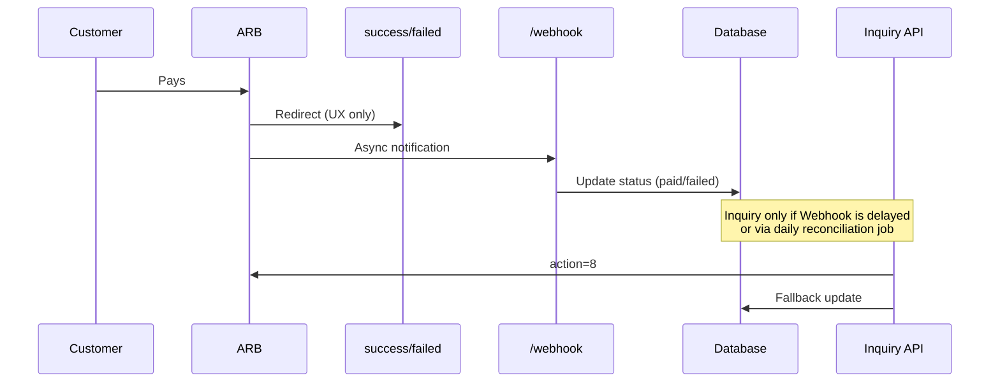

# AlRajhi Payment Gateway (Laravel Package)

Laravel package for integrating with Al Rajhi Bank payment gateway — compatible with **ARB Merchant Integration Guide REST v1.31**.

---

## Features

| Feature | Status |
|---------|--------|
| Bank Hosted — payment initiation | ✅ |
| Faster Checkout | ✅ |
| Iframe | ✅ |
| Apple Pay (Bank Hosted) | ✅ |
| Webhook — ARB notification handling | ✅ |
| Callback — `trandata` decryption | ✅ |
| BIN Check | ✅ |
| Payment status classification (CAPTURED / NOT CAPTURED / …) | ✅ |
| Inquiry API (`action=8`) | ✅ |
| Void / Refund / Capture | ❌ Coming soon |

---

## Installation

```bash
composer require alrajhi/payment-gateway
php artisan vendor:publish --tag=alrajhi-config
```

---

## Configuration (`.env`)

```env
ALRAJHI_BASE_URL=https://securepayments.alrajhibank.com.sa
ALRAJHI_ENVIRONMENT=sandbox
ALRAJHI_TRANPORTAL_ID=your_tranportal_id
ALRAJHI_TRANPORTAL_PASSWORD=your_password
ALRAJHI_RESOURCE_KEY=your_resource_key

ALRAJHI_URL_ENCODE_BEFORE_ENCRYPT=false
ALRAJHI_URL_DECODE_AFTER_DECRYPT=false
ALRAJHI_RETRY_RAW_TRANDATA_ON_INVALID=true

ALRAJHI_RESPONSE_URL=${APP_URL}/api/payment/success
ALRAJHI_ERROR_URL=${APP_URL}/api/payment/failed
ALRAJHI_WEBHOOK_SECRET=your_webhook_secret

ALRAJHI_STRICT_RESPONSE_MODE=false
ALRAJHI_ACCEPT_QUERY_RESPONSE=true
ALRAJHI_ACCEPT_DIRECT_CALLBACK_FIELDS=true

ALRAJHI_PREFER_CATALOG_MESSAGE=true
ALRAJHI_INCLUDE_OFFICIAL_MESSAGE=true
ALRAJHI_UDF_AUTO_FILL_DEFAULTS=false
ALRAJHI_CAPTURE_AUTO_SET_UDF7_R=true
```

> **Important (v1.31):** Every gateway request must include `X-FORWARDED-FOR` with the customer IP first. The package sets this automatically when calling `initiate()`.

---

## Initiate Payment (Bank Hosted)

```php
use AlRajhi\PaymentGateway\Facades\AlRajhiPayment;
use Illuminate\Http\Request;

Route::post('/test-payment', function (Request $request) {
    $trackId = 'TRK-' . now()->format('YmdHis') . '-' . random_int(1000, 9999);

    $forwardedFor = $request->header('X-Forwarded-For');
    $customerIp = is_string($forwardedFor) && $forwardedFor !== ''
        ? trim(explode(',', $forwardedFor)[0])
        : $request->ip();

    $payment = AlRajhiPayment::bankHosted()->initiate([
        'id' => config('alrajhi.credentials.tranportal_id'),
        'password' => config('alrajhi.credentials.tranportal_password'),
        'amount' => '1.00',
        'action' => '1',           // 1 = Purchase, 4 = Authorization
        'currencyCode' => '682',
        'trackId' => $trackId,
        'responseURL' => config('alrajhi.callbacks.response_url'),
        'errorURL' => config('alrajhi.callbacks.error_url'),
        'customerIp' => $customerIp,
    ]);

    return response()->json(['data' => $payment]);
});
```

**Successful response:**

```json
{
  "success": true,
  "payment_id": "600202616049354939",
  "payment_url": "https://securepayments.alrajhibank.com.sa/pg/paymentpage.htm",
  "redirect_url": "https://securepayments.alrajhibank.com.sa/pg/paymentpage.htm?PaymentID=600202616049354939",
  "track_id": "TRK-20260609095147-9076"
}
```

Redirect the customer to `redirect_url` to complete payment.

---

## Recommended Payment Flow

```
1. initiate()          → Get redirect_url
2. Customer pays       → On ARB payment page
3. Callback            → UX only — do NOT finalize DB updates here
4. Webhook             → Update order in database (source of truth)
5. Inquiry (action=8)  → Server-side fallback (if Webhook is delayed or for reconciliation)
```

### When should payment status be updated?

| Stage | When does it happen? | Update DB? | Role |
|-------|----------------------|------------|------|
| **Callback** (`success` / `failed`) | When customer returns from ARB page | ❌ No | Show message to user only |
| **Webhook** | Usually before or after callback (async) | ✅ **Yes — here** | Official source of truth |
| **Inquiry** | On demand from server (Job / Admin) | ✅ Yes (fallback) | If Webhook is missing or for reconciliation |

> **Do not call Inquiry on every success/failed callback** — it slows the page and duplicates what Webhook already does.  
> Professional pattern: Callback for UX → Webhook for DB update → Inquiry only on delay or reconciliation.



---

## Webhook (source of truth for order updates)

The package registers automatically:

```text
POST /alrajhi/webhook
```

**Example in your application:**

```php
Route::post('/webhook', function (Request $request) {
    $rawBody = (string) $request->getContent();
    $decoded = json_decode($rawBody, true);
    $payload = is_array($decoded) ? $decoded : $request->all();

    $ack = AlRajhiPayment::webhook()->process(
        $payload,
        function (array $data, string $type): void {
            // Successful or pending payment
            if ($data['payment_outcome'] === 'success') {
                // Payment::where('track_id', $data['track_id'])
                //     ->update(['status' => 'paid', 'payment_id' => $data['payment_id']]);
            }

            if ($data['payment_outcome'] === 'pending') {
                // Payment::where('track_id', $data['track_id'])
                //     ->update(['status' => 'processing']);
            }
        },
        function (array $errorData, string $type): void {
            // Failed payment
            // Payment::where('track_id', $errorData['transaction_data']['track_id'] ?? null)
            //     ->update(['status' => 'failed']);
        }
    );

    // ARB requires this exact format
    return response()->json($ack); // [{"status":"1"}]
});
```

**Important fields in `$transactionData`:**

| Field | Description |
|-------|-------------|
| `payment_outcome` | `success` \| `failure` \| `pending` \| `voided` \| `cancelled` |
| `normalized_status` | `CAPTURED`, `NOT CAPTURED`, `APPROVED`, … |
| `track_id` | Your unique reference |
| `payment_id` | ARB payment ID |
| `transaction_id` | ARB `transId` |
| `amount` | Transaction amount |

**ARB acknowledgment:**

```json
[{"status": "1"}]
```

On processing failure:

```json
[{"status": "0"}]
```

---

## Callback (customer UX only)

Do not rely on the callback to update order status — use it to display a message to the user.

```php
Route::post('/api/payment/success', function (Request $request) {
    $result = AlRajhiPayment::bankHosted()->handleResponse($request->all());
    $paymentResult = AlRajhiPayment::bankHosted()->handleResponseData($result);

    return response()->json(array_merge($paymentResult, [
        'payment_status' => $paymentResult['status_final'] ?? 'unknown',
        'confirmation' => [
            'source' => 'callback',
            'authoritative' => false,
            'message' => 'UX only — update order via Webhook, not here',
            'await_webhook' => true,
        ],
    ]));
});

Route::post('/api/payment/failed', function (Request $request) {
    $result = AlRajhiPayment::bankHosted()->handleResponse($request->all());
    $paymentResult = AlRajhiPayment::bankHosted()->handleResponseData($result);

    return response()->json(array_merge($paymentResult, [
        'payment_status' => $paymentResult['status_final'] ?? 'failed',
        'confirmation' => [
            'source' => 'callback',
            'authoritative' => false,
            'message' => 'UX only — update order via Webhook, not here',
            'await_webhook' => true,
        ],
    ]));
});
```

### Real callback response examples

These are actual responses from `POST /api/payment/success` after processing with `handleResponse()` + `handleResponseData()`.

#### ✅ Successful payment (`CAPTURED`)

```json
{
  "status_final": "success",
  "system_status": "success",
  "bank_status": "CAPTURED",
  "transId": 261601331202919,
  "date": "0609",
  "udf1": "",
  "udf2": "",
  "udf3": "",
  "udf4": "",
  "udf5": "",
  "authRespCode": "00",
  "authCode": "000000",
  "custid": null,
  "actionCode": "1",
  "ref": "616094017404",
  "result": "CAPTURED",
  "status": null,
  "is_success": true,
  "is_failure": false,
  "is_pending": false,
  "is_captured": true,
  "is_authorized": false,
  "is_cancelled": false,
  "is_voided": false,
  "error_code": null,
  "error_text": null,
  "payment_id": "600202616099491275",
  "track_id": "TRK-20260609103015-9910",
  "amount": "1.0",
  "card_type": "MASTERCARD",
  "card": "510510XXXXXX5100",
  "expMonth": "12",
  "expYear": "2027",
  "payment_status": "success"
}
```

> `actionCode: "1"` = purchase transaction type. `result: "CAPTURED"` = actual payment outcome.

#### ❌ Failed — 3DS not authenticated (`IPAY0100357`)

Customer did not complete card authentication (3DS). `bank_status` is `null` and `is_captured` is `false` even though `actionCode` is `"1"`.

```json
{
  "status_final": "failed",
  "system_status": "failed",
  "bank_status": null,
  "transId": null,
  "date": null,
  "udf1": "",
  "udf2": "",
  "udf3": "",
  "udf4": "",
  "udf5": "",
  "authRespCode": null,
  "authCode": null,
  "custid": null,
  "actionCode": "1",
  "ref": null,
  "result": null,
  "status": null,
  "is_success": false,
  "is_failure": true,
  "is_pending": false,
  "is_captured": false,
  "is_authorized": false,
  "is_cancelled": false,
  "is_voided": false,
  "error_code": "IPAY0100357",
  "error_text": "!ERROR!-IPAY0100357-NOT AUTHENTICATED",
  "payment_id": "600202616099692365",
  "track_id": "TRK-20260609102333-4086",
  "amount": "1.0",
  "card_type": "VISA",
  "card": null,
  "expMonth": null,
  "expYear": null,
  "payment_status": "failed"
}
```

#### ❌ Failed — payment option not enabled (`IPAY0100260`)

Terminal configuration issue in the ARB merchant portal — enable Visa / Mastercard / MADA for the terminal.

```json
{
  "status_final": "failed",
  "system_status": "failed",
  "bank_status": null,
  "transId": null,
  "date": null,
  "udf1": "",
  "udf2": "",
  "udf3": "",
  "udf4": "",
  "udf5": "",
  "authRespCode": null,
  "authCode": null,
  "custid": null,
  "actionCode": "1",
  "ref": null,
  "result": null,
  "status": null,
  "is_success": false,
  "is_failure": true,
  "is_pending": false,
  "is_captured": false,
  "is_authorized": false,
  "is_cancelled": false,
  "is_voided": false,
  "error_code": "IPAY0100260",
  "error_text": "!ERROR!-IPAY0100260-Payment option(s) not enabled",
  "payment_id": "600202616000417166",
  "track_id": "TRK-20260609102712-8561",
  "amount": "1.0",
  "card_type": null,
  "card": null,
  "expMonth": null,
  "expYear": null,
  "payment_status": "failed"
}
```

| Response | Key fields to check | Meaning |
|----------|---------------------|---------|
| Success | `result: "CAPTURED"`, `is_captured: true` | Payment completed |
| Auth failed | `error_code: "IPAY0100357"`, `bank_status: null` | 3DS authentication failed |
| Config error | `error_code: "IPAY0100260"`, `bank_status: null` | Enable card types in ARB portal |

> **Important:** Never use `actionCode` alone to determine payment success. Always check `result`, `bank_status`, and `is_captured`.

---

## Payment Statuses (ARB v1.31)

| ARB `result` | Meaning | `payment_outcome` |
|--------------|---------|-------------------|
| `CAPTURED` | Successful purchase | `success` |
| `APPROVED` | Successful authorization | `success` |
| `NOT CAPTURED` | Failed purchase | `failure` |
| `NOT APPROVED` | Failed authorization | `failure` |
| `PROCESSING` | Manual MADA refund in progress | `pending` |
| `VOIDED` | Void transaction | `voided` |
| `DENIED BY RISK` | Risk system rejection | `failure` |
| `HOST TIMEOUT` | Host timeout | `pending` |

> **Note:** `actionCode` = transaction type (`1` purchase, `4` authorization) — **not** the payment result. Do not use it to determine whether a payment was successful.

---

## Payment Verification (Inquiry API — `action=8`)

Use Inquiry for server-side verification when needed (e.g. if Webhook did not arrive). **Webhook remains the primary source** for order updates; Inquiry is for additional verification.

### By `transId` (most common)

```php
use AlRajhi\PaymentGateway\Facades\AlRajhiPayment;

$result = AlRajhiPayment::inquiry()->byTransId(
    transId: '261601253202722',
    amount: '1.00',
    trackId: 'TRK-20260609095147-9076',
);

// $result['status_final'] === 'success' && $result['result'] === 'CAPTURED' → paid
```

### By `PaymentID`

```php
$result = AlRajhiPayment::inquiry()->byPaymentId(
    paymentId: '600202616049354939',
    amount: '1.00',
    trackId: 'TRK-20260609095147-9076',
);
```

### By `trackId`

```php
$result = AlRajhiPayment::inquiry()->byTrackId(
    trackId: 'TRK-20260609095147-9076',
    amount: '1.00',
);
```

### Generic inquiry

```php
$result = AlRajhiPayment::inquiry()->inquire([
    'amount' => '1.00',
    'track_id' => 'TRK-20260609095147-9076',
    'reference_type' => 'TRANID',   // TRANID | PaymentID | TrackID
    'reference_id' => '261601253202722',
    'customer_ip' => '203.0.113.10', // optional — inferred from current request
]);
```

**Successful response:**

```json
{
  "status_final": "success",
  "bank_status": "CAPTURED",
  "payment_status": "success",
  "is_success": true,
  "is_captured": true,
  "payment_id": "600202616049354939",
  "track_id": "TRK-20260609095147-9076",
  "transId": "261601253202722",
  "result": "CAPTURED",
  "amount": "1.00"
}
```

> **Notes:**
> - `track_id` must match the value used in `initiate()`.
> - `amount` must match the original transaction amount.
> - Inquiry does not require `responseURL` / `errorURL` — the package does not send them.
> - **Do not call Inquiry from success/failed pages** — use it in Jobs, Admin panels, or when Webhook is delayed.

### Test API route

```http
POST /api/payment/inquiry
Content-Type: application/json

{
  "reference_type": "TRANID",
  "reference_id": "261601253202722",
  "amount": "1.00",
  "track_id": "TRK-20260609095147-9076"
}
```

**Response:**

```json
{
  "success": true,
  "confirmation": {
    "source": "inquiry",
    "authoritative": true,
    "use_case": "reconciliation_or_webhook_fallback",
    "is_paid": true,
    "message": "Verified with bank — payment is successful"
  },
  "data": { "status_final": "success", "result": "CAPTURED" }
}
```

### Reconciliation job (example — if Webhook did not arrive within 5 minutes)

```php
// app/Jobs/ReconcilePendingPayment.php
Payment::where('status', 'pending')
    ->where('created_at', '<', now()->subMinutes(5))
    ->each(function (Payment $payment) {
        $result = AlRajhiPayment::inquiry()->byTrackId(
            trackId: $payment->track_id,
            amount: number_format($payment->amount, 2, '.', ''),
        );

        if (($result['status_final'] ?? null) === 'success') {
            $payment->update(['status' => 'paid', 'confirmed_via' => 'inquiry']);
        }
    });
```

---

## BIN Check

```php
$binData = AlRajhiPayment::binCheck('446404');
// country, bank, card (MADA/Visa/MasterCard), status
```

---

## Other Services

```php
AlRajhiPayment::bankHosted();      // Standard bank-hosted payment
AlRajhiPayment::fasterCheckout();  // Faster Checkout
AlRajhiPayment::iframe();          // iFrame (udf3 = iframe)
AlRajhiPayment::applePay();        // Apple Pay
AlRajhiPayment::webhook();         // Webhook processing
AlRajhiPayment::inquiry();         // Inquiry API (action=8)
AlRajhiPayment::binCheck('446404');
```

---

## UDF Policy

- Supports `udf1` through `udf10` (string, max 255 characters).
- When `ALRAJHI_UDF_AUTO_FILL_DEFAULTS=true`, `udf1..udf5` are auto-filled.
- For Capture operations (`action=5`): `udf7=R` is set automatically when enabled.
- `udf10` for MADA Capture: `PARTIALCAPTURE` or `FINALCAPTURE`.

---

## Troubleshooting

### `IPAY0100013` — Invalid transaction data

- Verify `tranportal_id`, `password`, and `resource_key`.
- Amount must use two decimal places: `1.00` not `1`.
- `responseURL` and `errorURL` must be publicly accessible HTTPS URLs.
- Use `currencyCode=682`.
- After changing `.env`: run `php artisan optimize:clear`.
- The package automatically retries without URL-encoding on this error.

### `IPAY0100260` — Payment option(s) not enabled

Terminal configuration in the ARB portal — enable Visa / Mastercard / MADA as needed.

### Webhook not updating orders

- Ensure ARB sends notifications to `/webhook` or `/alrajhi/webhook`.
- Response must be `[{"status":"1"}]` not `{"status":"1"}`.
- Check `payment_outcome`, not `actionCode`.

---

## Encryption

- **Algorithm:** AES-256-CBC
- **IV:** `PGKEYENCDECIVSPC`
- **Key:** Resource Key from ARB
- Requests and responses are encrypted/decrypted in the `trandata` field.

---

## License

MIT — Yacoub Al-haidari
